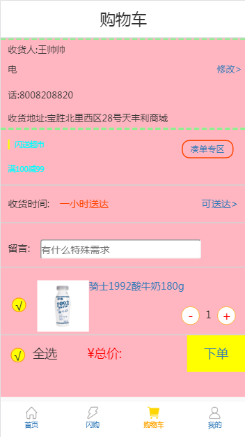

# 爱鲜蜂

该项目主要用于教学使用，该爱鲜蜂项目是商城系统，主要功能有首页展示，闪购超市，购物车，个人中心等

### day01：

 1）开发流程---先演示配置好的，并且运行起来的项目

        a) 先看运行起来的项目，大致看看开发功能有那些，实现技术要使用那些
        b）需要使用的模型创建，字段的定义
        c）提供数据---事先准备好插入数据的sql，第二天提供

 2） 项目搭建

		a）虚拟环境搭建
			a1）pychram的解释器interpreter的配置
			a2）debug的配置
			virtualenv --no-site-packages -p D:/python3/python3.6.exe env

 		b）创建项目
			b1）创建app
			b2）创建templates
			b3）创建静态文件
			b4）开发接口文档doc目录的创建
			b4）settings.py文件中的installed_app的配置，databases的配置，templates的配置，static的配置,
				login_url = '/login/'
			b5）工程的__init__.py中初始化pymysql，install_as_mysqldb

		c）前端页面渲染
			c1）模板的继承，定义base.html，挖坑以及填坑
			c2）静态css，js，img的渲染。以及直接/static/css/xxx.css

 3）功能的梳理

	a）框架分析
		a1）用户中心
		a2）首页商品展示
		a3) 闪购（商品列表）
		a4）购物车
			a4.1）订单系统
			a4.2）收货地址
			a4.3）支付
			a4.4）积分系统
			a4.5）vip
			a4.6）物流
			a4.7）评论系统
			a4.8）优惠券
	b）开发过程
		b1）首页--闪购--购物车--个人模块

 4）后端页面渲染

	a）编写urls-->views的逻辑
	b）把首页/闪购/购物车/我的页面，全部render渲染出来，不用加载数据都可以

 5）首页展示信息模型定义

	a）banner轮播模型定义
	b）导航栏模型定义
	c）必购模型定义
	d）商店模型定义     ---->以上模型定义都一样

 6）闪购模型定义（FoodType）

	a）闪购左侧菜单分类
	b）顶测分类
		b1）全部类型----全部分类
		b2）综合排序----综合排序、销量排序、价格排序、价格升序
	c）定义搜索url、/axf/market/ID1/ID2/ID3/
		c1）ID1:左侧菜单分类id
		c2）ID2：全部类型的分类（0）
		c3）ID3：综合排序的分类（0,1,2,3）

部分功能图片: 以下展示首页

作业：先演示讲模板拆分为基础模板，然后通过继承挖坑等技术来完成模板的拆分

	1）拆分所有的模板
	2）页面可点击各模板，展示对应的页面，首页/闪购/购物车/个人中心等
	3）登录注册退出----使用中间件的方式
	4）头像上传

### day02：

*）上午演示登录注册注销功能（客户端和服务端都验证令牌的时效）

	a) 令牌验证，创建单独的表，存令牌和过期时间
	b) cookie中设置缓存时间

	c) 也可以使用django自带的登录 authenticate login logout

 1）中间件的配置

	a）判断cookies中是否有登录的令牌ticket，如果没有不做任何处理
	b）如果cookies中有令牌，则去数据库userticket表中去判断令牌是否有效
	c）令牌无效或者过期的话，不做任何处理
	d）令牌有效的话，将user的数据给request.user

 2) 个人中心模块

	a）先验证request中是否有user的信息，如果有则在个人中心页面中渲染用户名，头像图片等信息
		a1）待付款和待收货的数据刷新，通过user找到order订单表，查看订单表的订单状态

	c）没有验证到request中的user信息的话，则在个人中心页面中，展示登录以及注册的按钮的信息

 3）购物车页面

	a）如果request中没有user的信息，则跳转到登录页面

 4）注册

	a）ajax在用户名的onblur的点击的时候，执行查询用户名是否重复的请求，并展示查询的结果，用户名重复或者用户名可用

 5）登录

	a）随机生成ticket，存放在cookies中，设置过期时间
	b）userticket表中存用户和ticket的信息，以及过期时间，过期时间和cookies中的过期时间一致

部分功能展示： 登录注册, 个人中心

### day03：

a）购物车模型 （CartModel）

	a1）购物车页面展示，购物车中信息展示

b）购物车逻辑分析，模型和订单模型的关联等

	b1) 关联用户，关联商品，数量等

d）增加或者删除选购商品数量,使用ajax异步修改数据

	b1）增加/axf/addtocart/?goodsid=475
	b2）删除/axf/subtocart/?goodsid=475
	b3）选中下单的商品，is_select字段，创建订单的时候过滤掉is_select为False的商品数据

e）下单订单生成

	e1）订单模型order，购物车下单以后生成订单信息，包括用户信息，订单支付状态，订单创建时间等
	e2）根据订单信息创建订单和商品的表信息，该表中关联订单，关联商品，商品的数量等信息

作业：

	1. 商品购物车全选或者全不选实现
	2. 商品购物车中的总价展示实现
	3. 商品购物车中删除商品的个数为0时，该商品不展示
	4. 闪购页面的商品数量数据的刷新，使用ajax去刷新

部分功能展示：闪购，购物车

### day04：

 1） 订单支付

	a1）点击订单支付alipay的按钮，实现修改订单的支付状态，并且跳转到个人中心页面

2）个人中心页面

	b）个人中心的待支付页面，待收货页面

	c）个人中心的待收货刷新，代付款订单个数刷新

部分功能展示： 支付页面，待收货/代付款页面

### day05:

复习1：

	a）复习所有代码

部署2: 测试环境部署方式和线上环境nginx+uwsgi部署方式：

部署的服务器采用的是ubuntu16系统

#### 环境搭建:

1. 安装包
	
		sudo apt update
	
		apt install mysql-server mysql-client
	
2. 设置远程访问mysql
	
		a) 查找 mysql.conf 
			find / -name mysql.cnf

		b）注释mysql.cof文件的bind_address
			cd /etc/mysql/mysql.conf.d
			vim mysqld.cnf
	
		c）切换mysql数据库
		   use mysql;
	
	       GRANT ALL PRIVILEGES ON *.* TO 'root'@'%' IDENTIFIED BY 'root123' WITH GRANT OPTION;
	
		   flush privileges; 

		d) 重启
		   service mysql restart /status/ stop/ start

#### 在测试环境中部署方式：
	
1. 修改django的配置文件

		a）修改settings.py文件中的DEBUG=FALSE，ALLOWED_HOST=['*']

		b）修改urls.py
	
			b1）url中加入以下配置
			from django.views.static import serve
			url(r'^static/(?P<path>.*)$', serve, {"document_root": settings.STATIC_ROOT}),
			url(r'^media/(?P<path>.*)$', serve, {"document_root": settings.MEDIA_ROOT}),

			b2）setting中
			STATIC_ROOT = os.path.join(BASE_DIR, 'static')

			b3）url中修改首页访问的地址
			url(r'^$', views.home)
	
	
2. 修改首页的启动地址

		修改工程目录中的url ，并修改url(r'^$', views.home)
	
3. 安装pip3

		apt install python3-pip
	
4. 安装必备库

		pip3 install django==1.11
		pip3 install pymysql
		pip3 install Pillow
	
5. 查看进程

	 	netstat -lntp
	
6. 启动项目
7. 
		python3 manage.py runserver 0.0.0.0:80

#### 使用nginx+uwsgi配置django项目

1. 安装nginx

		sudo apt install nginx
	
2. 查看nginx的状态

		systemctl status nginx 查看nginx的状态
		systemctl start/stop/enable/disable nginx 启动/关闭/设置开机启动/禁止开机启动
		
		或者是如下命令：

		service nginx status/stop/restart/start

3. 安装uwsgi
	
		pip install uwsgi

4. nginx的配置文件中加载自定义的nginx的配置文件

		vim /etc/nginx/nginx.conf
		在server中加入以下配置：
		include /home/app/conf/*.conf;

5. 配置自定义的nginx配置文件

		server {
		    listen       80;
		    server_name 47.92.164.198 localhost;
	
		    access_log /home/app/log/access.log;
		    error_log /home/app/log/error.log;
	
		    location / {
		        include uwsgi_params;
		        uwsgi_pass 127.0.0.1:8890;
		    }
		    location /static/ {
		        alias /home/app/day11axf0/static/;
		        expires 30d;
		    }
	
		}

6. 配置uwsgi，名称为uwsgi.ini

		[uwsgi]
		# variables
		projectname = day11axf0
		newprojectname = day11axf
		base = /home/app
	
		# config
		#plugins = python
		master = true
		#protocol = uwsgi
		processes = 4
		#env = DJANGO_SETTINGS_MODULE=%(projectname).settings
		pythonpath = %(base)/%(projectname)
		module = %(newprojectname).wsgi
		socket = 127.0.0.1:8890
		logto = %(base)/log/uwsgi.log

	启动方式： uwsgi --ini uwsgi.ini

### 重点：

#### nginx + uWSGI + django的处理流程

- 首先nginx 是对外的服务接口，外部浏览器通过url访问nginx,

- nginx 接收到浏览器发送过来的http请求，将包进行解析，分析url，如果是静态文件请求就直接访问用户给nginx配置的静态文件目录，直接返回用户请求的静态文件，

- 如果不是静态文件，而是一个动态的请求，那么nginx就将请求转发给uwsgi,uwsgi 接收到请求之后将包进行处理，处理成wsgi可以接受的格式，并发给wsgi,wsgi 根据请求调用应用程序的某个文件，某个文件的某个函数，最后处理完将返回值再次交给wsgi,wsgi将返回值进行打包，打包成uwsgi能够接收的格式，uwsgi接收wsgi发送的请求，并转发给nginx,nginx最终将返回值返回给浏览器。

- 要知道第一级的nginx并不是必须的，uwsgi完全可以完成整个的和浏览器交互的流程，但是要考虑到某些情况

  - 安全问题，程序不能直接被浏览器访问到，而是通过nginx,nginx只开放某个接口，uwsgi本身是内网接口，这样运维人员在nginx上加上安全性的限制，可以达到保护程序的作用。

  - 负载均衡问题，一个uwsgi很可能不够用，即使开了多个work也是不行，毕竟一台机器的cpu和内存都是有限的，有了nginx做代理，一个nginx可以代理多台uwsgi完成uwsgi的负载均衡。

  - 静态文件问题，用django或是uwsgi这种东西来负责静态文件的处理是很浪费的行为，而且他们本身对文件的处理也不如nginx好，所以整个静态文件的处理都直接由nginx完成，静态文件的访问完全不去经过uwsgi以及其后面的东西。

uWSGI是一个Web服务器，它实现了WSGI协议、uwsgi、http等协议。Nginx中HttpUwsgiModule的作用是与uWSGI服务器进行交换。

